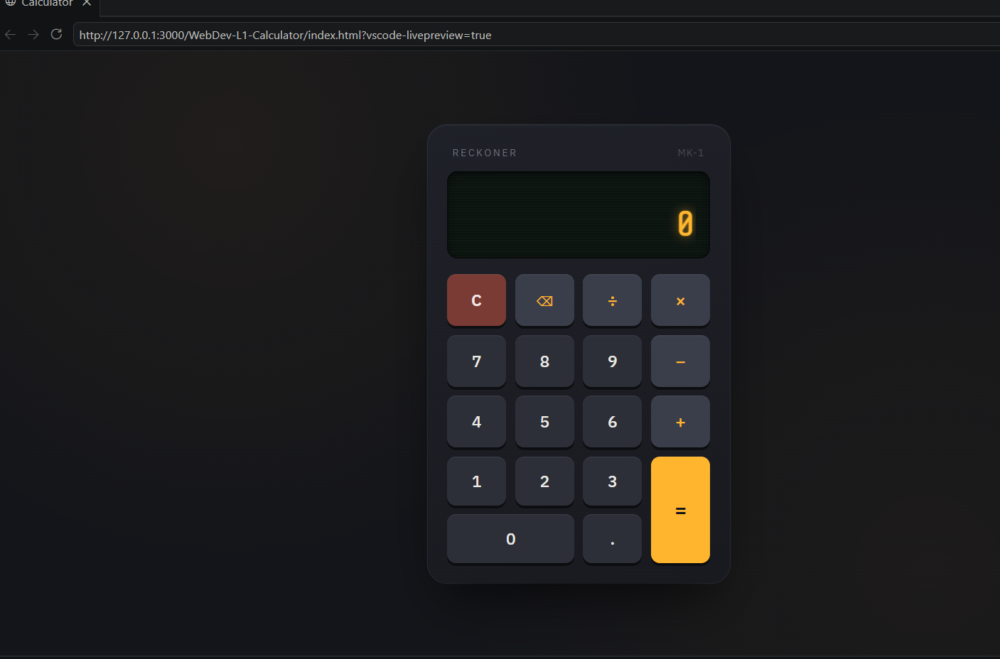
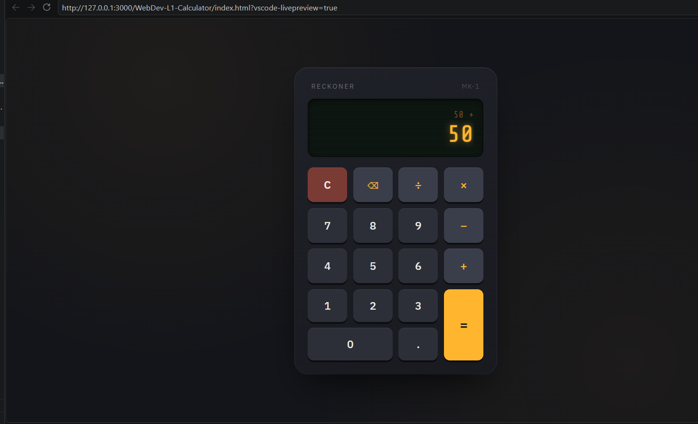
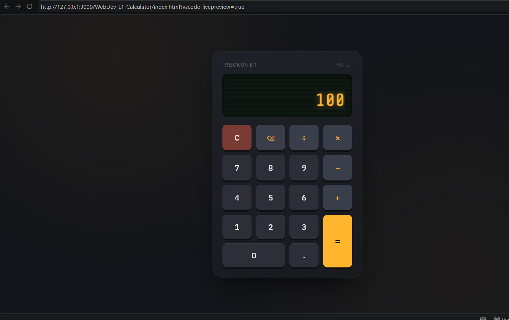

# 🧮 Calculator

A responsive and modern Calculator built using **HTML**, **CSS**, and **JavaScript**.

---

## 📌 Project Description

This calculator performs basic arithmetic operations with a clean and responsive user interface. It works seamlessly on both desktop and mobile devices.

---

## 🚀 Technologies Used

- HTML5
- CSS3
- JavaScript

---

## ✨ Features

- ➕ Addition
- ➖ Subtraction
- ✖️ Multiplication
- ➗ Division
- 📱 Responsive Design
- 🎨 Modern UI

---

## 📁 Folder Structure

```
WebDev-L2-Calculator/
│
├── index.html
├── style.css
├── script.js
├── README.md
└── screenshots/
    ├── calculator-home.png
    ├── calculator-working.png
    └── calculator-mobile.png
```

---

## 📷 Screenshots

### 🏠 Home Page



### 🧮 Working Calculator



### 📱 Mobile View



---

## ▶️ How to Run

1. Clone this repository:

```bash
git clone https://github.com/Vinit21-07/OIBSIP.git
```

2. Open the project folder.

3. Navigate to:

```
WebDev-L2-Calculator
```

4. Open `index.html` in your browser.

---

## 👨‍💻 Author

**Vinit Chaudhari**

GitHub: https://github.com/Vinit21-07