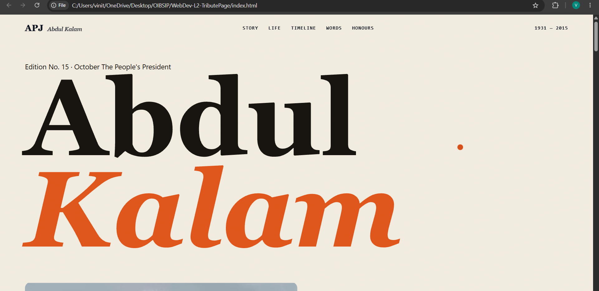
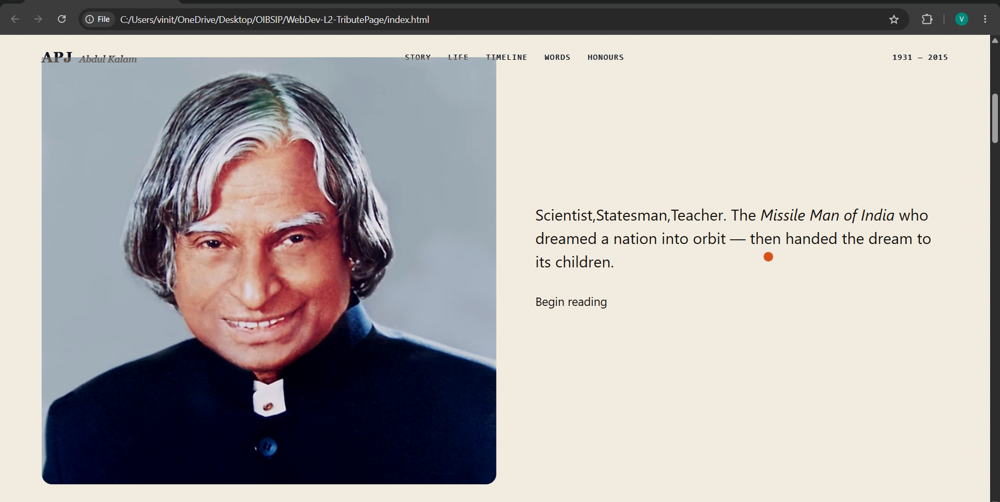
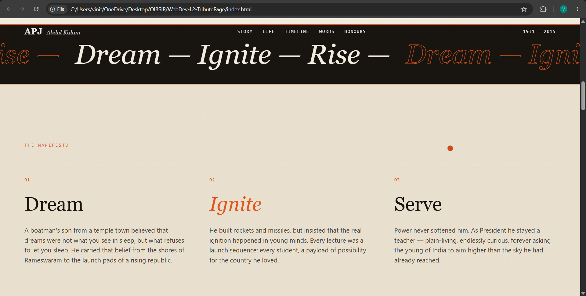
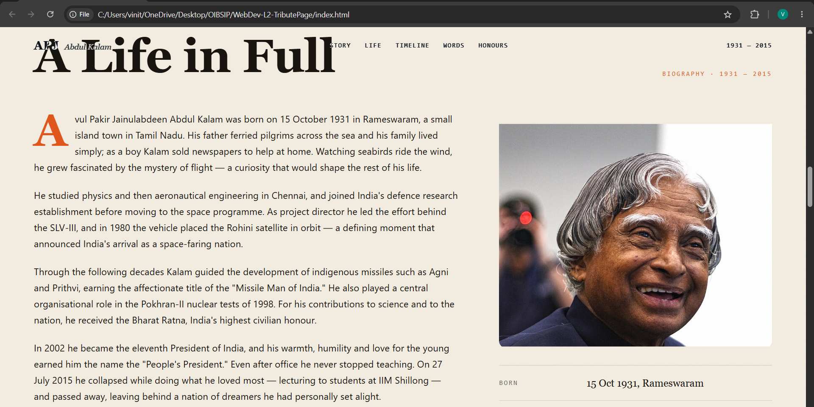
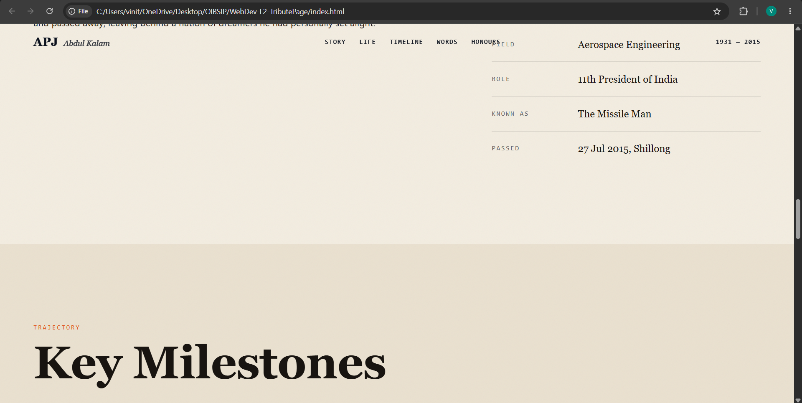
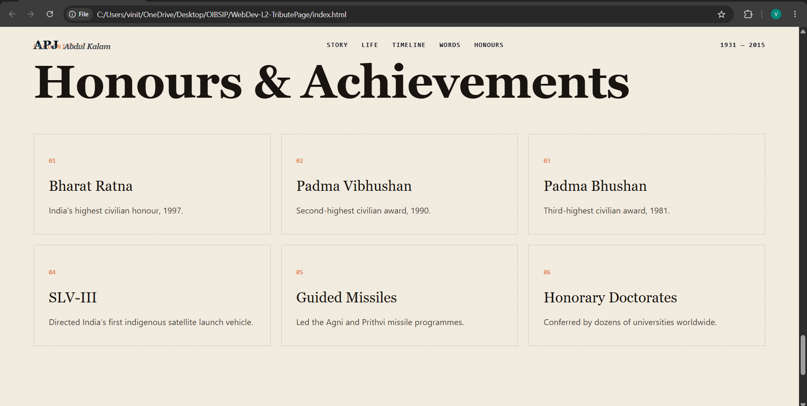
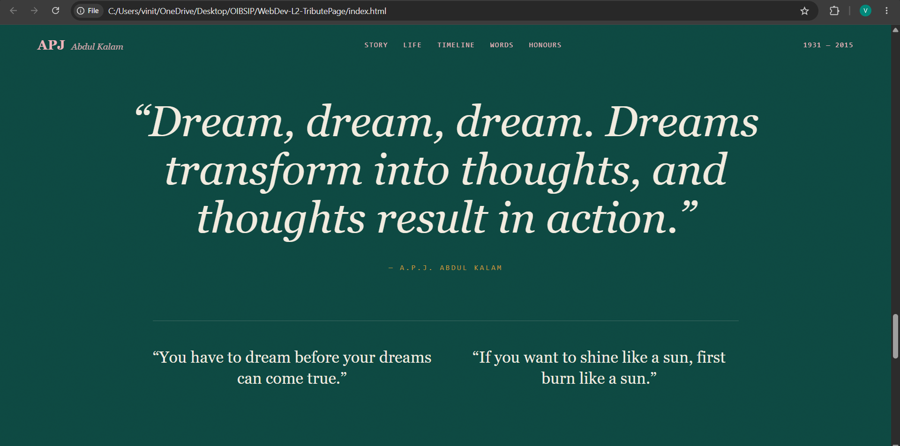
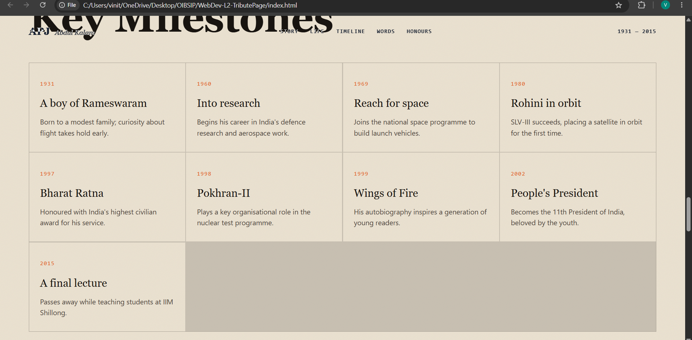
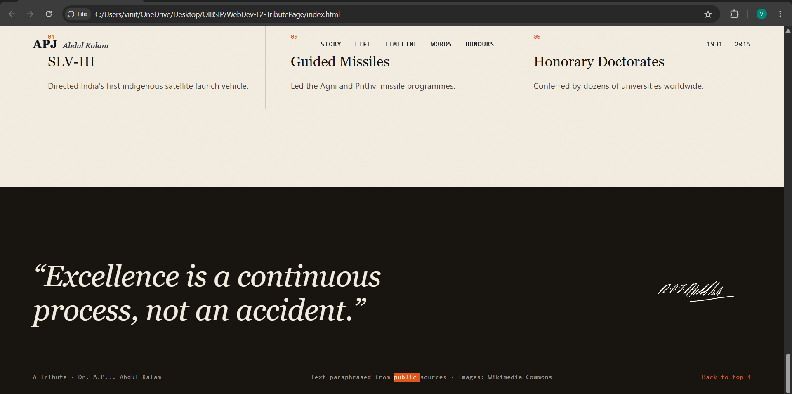

# 🌟 A.P.J. Abdul Kalam Tribute Website

> A modern, responsive, and animated tribute website dedicated to **Dr. A.P.J. Abdul Kalam**, the Missile Man of India and the 11th President of India.

This project was developed as **Level 2 - Task 2** during my **Frontend Development Internship at Oasis Infobyte**.

---

## 📸 Project Preview

### 🏠 Home
> 

---

### 👤 Introduction
> 

---

### 📖 Story
> 

---

### 🌍 Life in Full
> 

---

### 🕒 Timeline
> 

---

### 🏆 Honours & Achievements
> 

---

### 💬 Inspirational Quotes
> 

---

### 📌 Key Milestones
> 

---

### ⭐ Footer
> 

---

# 🚀 Features

- ✨ Modern Editorial UI Design
- 📱 Fully Responsive Layout
- 🎬 GSAP Scroll Animations
- 🚀 Lenis Smooth Scrolling
- 🎨 Custom Animated Cursor
- 🖼️ Parallax Image Effects
- 📖 Biography Section
- 🕒 Interactive Timeline
- 🏅 Honours & Achievements Cards
- 💬 Inspirational Quotes Section
- 🔝 Back-to-Top Navigation
- ⚡ Fast & Lightweight

---

# 🛠️ Built With

- HTML5
- CSS3
- JavaScript (ES6)
- GSAP
- ScrollTrigger
- Lenis Smooth Scroll
- Google Fonts

---

# 📂 Folder Structure

```
WebDev-L2-TributePage
│
├── index.html
├── style.css
├── script.js
├── Home.png
├── Introduction.png
├── Story.png
├── Life.png
├── Timeline.png
├── Honours.png
├── Words.png
├── Milestones.png
├── Quote.png
└── README.md
```

---

# 💡 Sections Included

- Hero Section
- Story
- Biography
- Timeline
- Quotes
- Honours & Achievements
- Footer

---

# 🎯 What I Learned

During this project, I improved my skills in:

- Responsive Web Design
- Modern CSS
- Flexbox & CSS Grid
- JavaScript DOM Manipulation
- GSAP Animations
- Smooth Scrolling
- ScrollTrigger
- UI/UX Design
- Interactive Web Development

---

# ⚙️ Installation

Clone the repository

```bash
git clone https://github.com/Vinit21-07/WebDev-L2-TributePage.git
```

Move to the project folder

```bash
cd WebDev-L2-TributePage
```

Open **index.html**

or simply use **Live Server** in VS Code.

---

# 🌐 Live Demo

you can view the live demo of the project(https://vinit21-07.github.io/WebDev-L2-TributePage/).

# 🤝 Contributing

Contributions are always welcome!

1. Fork the repository
2. Create a new branch

```
git checkout -b feature-name
```

3. Commit changes

```
git commit -m "Added new feature"
```

4. Push

```
git push origin feature-name
```

5. Open a Pull Request

---

# 📜 License

This project is developed for educational and learning purposes.

---

# 👨‍💻 Author

**Vinit Chaudhari**

### GitHub
https://github.com/Vinit21-07

### LinkedIn
https://www.linkedin.com/in/vinit-chaudhari-654b0b31b/

---

## ⭐ Show your support

If you liked this project, don't forget to ⭐ **Star** this repository.

